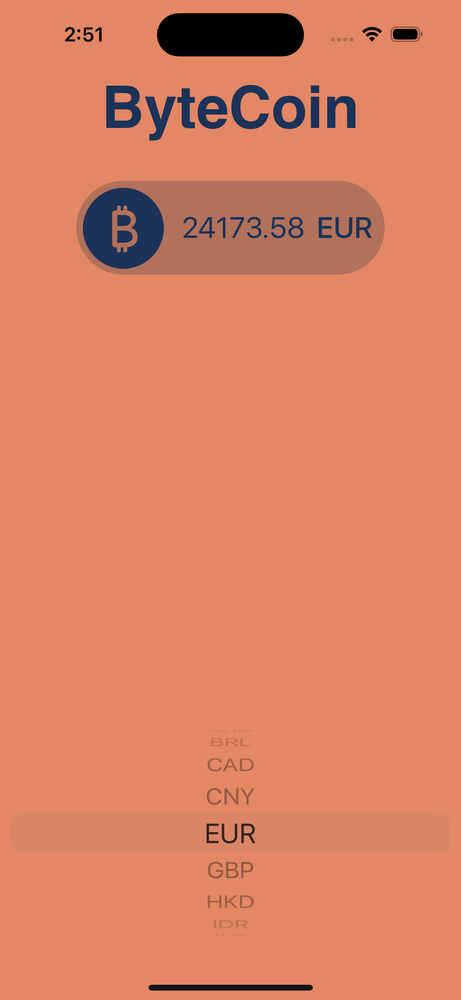
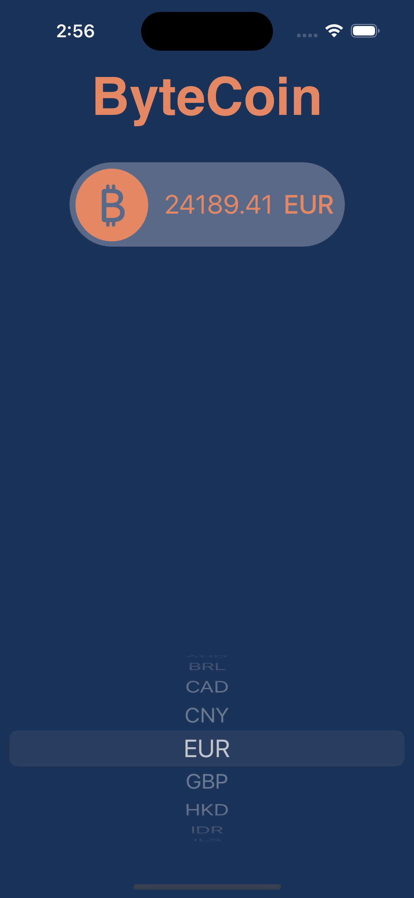

# ByteCoin
**Purpose of the App :**

A simple app that gets the price of bitcoin in selected currency.

##

**Features Learned :**

Closures, Delegate, URLSession, Codable, JSON, REST API, JSONDecoder, GCD

##

**Screenshoots :**
| Dark | Light| 
|----------|----------|
|    |    |

